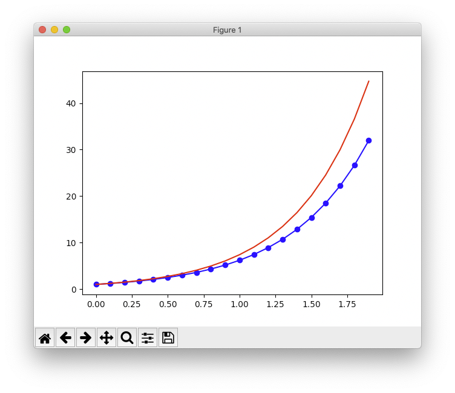
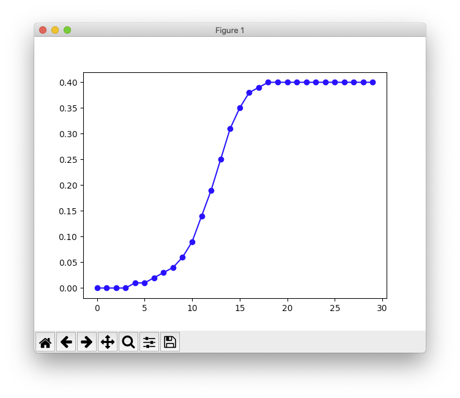
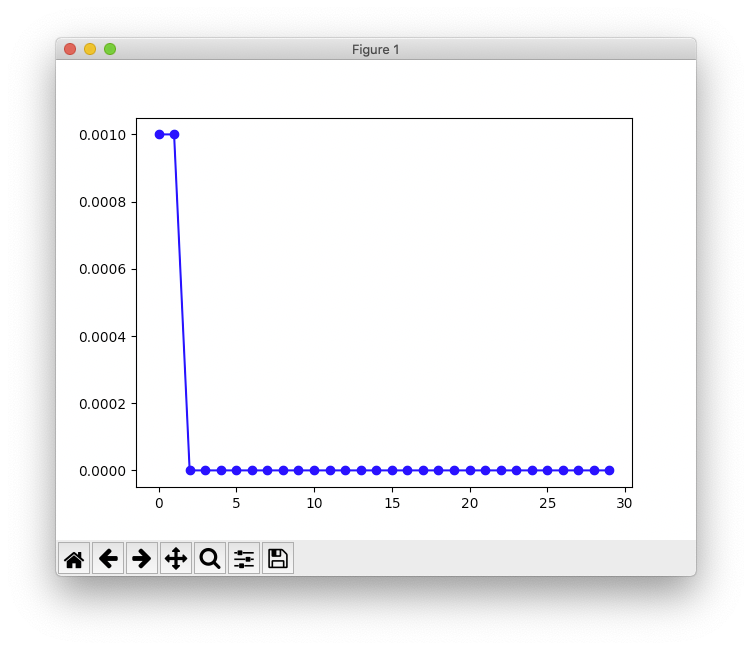

# Objectives

This practical has been developed in collaboration with Dr. Javier
Macia to strengthen some of the concepts and methods developed in
the Mathematics subject, jointly with FCB.
The learning objectives for this practical are:

 * Implement in Python the SIR model of spreading infectious diseases.
 * Parametrize the Python implementation from the command line.
 * Use the implemented model to explore effect of different parameters.
 * Make syntax errors in Python.
 * Correct syntax errors in Python.
 * Debug your program when it doesn't work.

Whenever you are stuck with an error, please consult the section
entitled "Debugging" from [practical 4](/practical4/).

# Setup and background

To do this practical you need an installation of Python version 3. You can find
the instructions in the [setup](/setup/) link on how to install Python version 3
in your system. Once Python is installed, you should be able to call it from
the shell in the terminal window. You can check whether that is possible by typing:

```
$ which python
$ python --version
```

It may happen that you have two Python installations, one corresponding
to version 2.x and another to version 3.x. In that situation the previous command
may say that your Python version is 2.x and to access the version 3 you need to call
the executable `python3`. Try then for instance:

```
$ python3 --version
```

If this is your case, then whenever the executable `python` is invoked in the rest of
this practical, please use `python3` instead.

We will be also using the Python libraries _numpy_, _pandas_ and _matplotlib_. To
install them type on the command line the following instructions:

```
$ pip install numpy
$ pip install pandas
$ pip install matplotlib
```

If your Python 3.x installation is available through the `python3` command,
replace the `pip` executable by `pip3`.

# The differential equation for a simplified SIR model

A simplified [SIR model](https://en.wikipedia.org/wiki/Compartmental_models_in_epidemiology)
of spreading an infection can be described with the following ordinary
differential equation:

$$\begin{equation}
    \label{eq:sir}
    \frac{dI}{dt}=\rho\cdot I \cdot (1 - I) - \alpha \cdot I
  \end{equation} $$
where

* $I$ is the fraction ($0\leq I\leq 1$) of infected population. We split the entire
population in two fractions, infected ($I$) and uninfected ($1-I$).

* $\rho$ is the average number of people who will get infected with a contagious
disease from one person with that disease, also known as $R_0$ or
[basic reproduction number](https://en.wikipedia.org/wiki/Basic_reproduction_number).

* $\alpha$ is the average number of people who recovers from the disease.

Implement a script in Python called `sir.py` that takes the two previous terms
$\rho$ and $\alpha$ as arguments in the command line and prints the calculation
for $dI/dt$ using Equation $\eqref{eq:sir}$ and a fixed value of $I=0.1$.
Because the $\rho$ and $\alpha$ arguments are non-integer values, you will
need to coerce them from character string to the Python data type _float_
using the function `float()` instead of the function `int()` that you would
normally use for integer values.

For instance, the following call should give `0.045` as a result when calling
this script with $\rho=1.5$ and $\alpha=0.9$.

```
$ python sir.py 1.5 0.9
0.045
```

Moreover, when the script is called without arguments or with the wrong number of
arguments, the following message should be shown:

```
$ python sir.py 
error: sir.py <rho> <alpha>
```

# Solving a ordinary differential equation with the Euler method

A simple ordinary differential equation (ODE) of the form

$$
\begin{equation}
\label{eq:cx}
\frac{dX}{dt} = c\cdot X
\end{equation}
$$

where $X$ changes with $t$ and $c$ is some constant value, it can be
analytically solved by moving terms and integrating separately both
sides of the equality as follows
(see a [list of integrals](https://en.wikipedia.org/wiki/Lists_of_integrals))

$$ \begin{eqnarray}
   \frac{1}{X}\cdot dX & = & c\cdot dt \nonumber \\
   ln(X) & = & c\cdot t \nonumber \\
   X & = & e^{ct} \label{eq:ect}
   \end{eqnarray} $$

However, such an exact solution often does not exist and we need to
rely on numerical integration methods to find an approximate solution.
The simplest of such methods is the
[Euler's method](https://en.wikipedia.org/wiki/Euler_method), which is
based on calculating the slope of the tangent line to the curve corresponding
to the differential equation that we want to approximate.

](Euler_method.png)

Given a generic (first-order) ODE of the form

$$ \frac{dX}{dt} = f(t, X) $$

and equally-spaced time points

$$ \begin{equation}
     t = \{t_0, t_1, ..., t_n\} \nonumber
   \end{equation} $$
so that for any two given time points

$$ \begin{equation}
     h =  t_i - t_{i-1} \nonumber
   \end{equation} $$
the Euler's method approximates the next value of $X$ using
the following recurrence

$$ \begin{eqnarray}
     X_1 & = & X_0 + h\cdot f(t_0, X_0) \nonumber \\
     X_2 & = & X_1 + h\cdot f(t_1, X_1) \nonumber \\
     X_3 & = & X_2 + h\cdot f(t_2, X_2) \nonumber \\
     \vdots & = & \vdots \nonumber \\
     X_n & = & X_{n-1} + h\cdot f(t_{n-1}, X_{n-1}) \nonumber 
   \end{eqnarray} $$

for some initial (condition) value $X_0$. This can
be compactly written using the following recurrence formula

$$ \begin{eqnarray}
     X_i & = & X_{i-1} + h\cdot f(t_{i-1}, X_{i-1})
   \end{eqnarray} $$

We are going to illustrate the Euler's method by implementing it
in Python for the previous example Equation $\eqref{eq:cx}$.
In a file called `euler.py` enter the following code:

```
import numpy as np

## ODE that we want to integrate
def f(X, c) :
    dX = c*X
    return(dX)

## Euler's method for numerical integration of the f() function
def euler(X0, c, t) :
    X = np.zeros(len(t))
    X[0] = X0
    h = t[1] - t[0]
    i = 0
    while (i < (len(t)-1)) :
        X[i+1] = X[i] + h * f(X[i], c)
        i = i + 1

    return(X)

## set time points between 0 and 2 in steps (h) of 0.1
t = np.arange(0, 2, 0.1)

## initial value
X0 = 1

## constant for dX = c X
c = 2

## integrate dX = c X with Euler's method
X = euler(X0, c, t)

## print resulting values for each time point
print("t,dX")
i = 0
while (i < len(X)) :
    print("%.3f,%.3f" %(t[i], X[i]))
    i = i + 1
```

This Python script approximates the solution for the ODE $\eqref{eq:cx}$
using an initial value $X_0=1$, a constant $c=2$ and equally spaced time
points of size $h=0.1$ between $t_0=0$ and $t_n=2$. Run it in the following
way from the Unix shell to store the results in a file called `ode2xh01.csv`:

```
$ python euler.py > ode2xh01.csv
$ head ode2xh01.csv 
t,dX
0.00,1.00
0.10,1.20
0.20,1.44
0.30,1.73
0.40,2.07
0.50,2.49
0.60,2.99
0.70,3.58
```

Now, let's visualize the calculated curve next to the exact solution from
Equation $eqref{eq:ect}$ by running the Python interpreter and interactively
typing the following instructions:

```
>>> import numpy as np
>>> import pandas as pd
>>> import matplotlib.pyplot as plt
>>> ode2xh01 = pd.read_csv("ode2xh01.csv")
>>> plt.plot(ode2xh01['t'], ode2xh01['dX'], '-bo')
>>> plt.plot(ode2xh01['t'], np.exp(2*ode2xh01['t']), '-ro')
>>> plt.show()
```

The last three instructions are the ones to plot the results using
the Python library [matplotlib](https://matplotlib.org), where the
first two prepare the plotting layout and graphical parameters and
the third one executes de plot on the screen. While this is happening
the Python prompt will be waiting for the plotting window to close.
Therefore, to continue using the Python interpreter you need to close
the plotting window first.

The resulting plot should look like this one below, where the red line
corresponds to the exact solution and the blue line with dots to the
approximate solution obtained by doing numerical integration with the
Euler's method.



Change the size of the steps ($h$) from 0.1 to a smaller size such as
0.05, calculate the approximate curve again and plot it next to the
exact curve. Is this new approximation better or worse than the
previous one? Could you think about why?

# Solving the simplified SIR model

Finally, we are going to solve the simplified SIR model of Equation
\eqref{eq:sir} by taking the code in `euler.py` and integrating it
into our script `sir.py`. As part of this integration, please set
the initial value of I at $t_0$ to `0.001` and the time points from
$t_0=0$ to $t_n=30$ in steps of $h=1$ unit.

Please also pay attention to the following points:

1. What should be the function `f()` from the `euler.py` script?

2. What arguments should take now the function `euler()`? Should the
code of this function change?

3. What should be doing the `main()` function in our script `sir.py`? 

Once you have done the intregation of the code, you should be able
to call the script `sir.py` in an analogous way we were doing it with
the script `euler.py`, redirecting the output to a CSV file and being
able to change the parameters $\rho$ and $\alpha$ in the command
line. More concretely, please run the simulation with the following
values of $\rho$ and $\alpha$:


* $\rho=1.5, \alpha=0.9$: Because $\rho > \alpha$ the stable equilibrium
point of $I^*$ should be at $1-\alpha/\rho$, does it match? The plot
should be similar to this one below.



* $\rho=1.5, \alpha=1.9$: Because $\rho < \alpha$ the stable equilibrium
point of $I^*$ should be at 0, does it match? The plot should be
similar to this one below.



Play with different values of $\rho$ and $\alpha$ to gain understanding
on the dynamics of this simplified SIR model. A straightforward extension
of the script would be to parametrize in command line the initial condition
$I_0$ and the time points. A simple approach to parametrize the latter would
be to assume a fixed starting time point and take the maximum time point
$t_n$ and the step in time difference $h$. You could also consider some
default values for these additional parameters and that they would be
_optional_ for the user.
